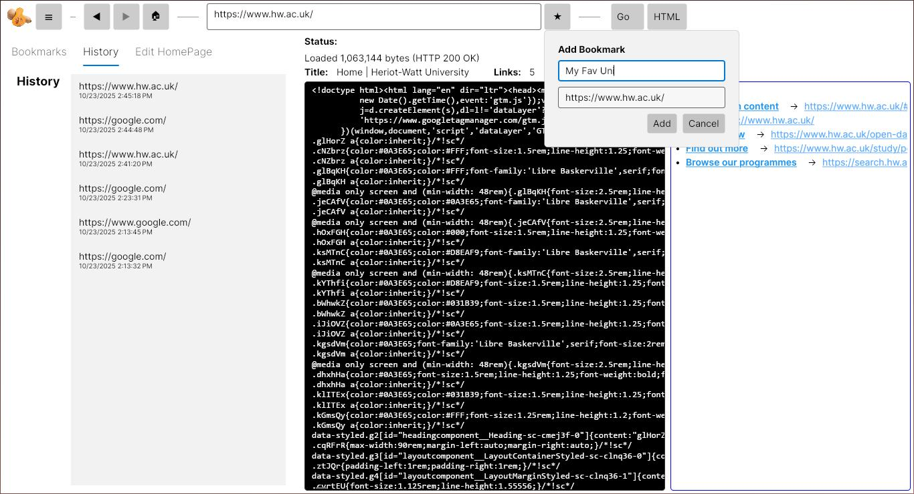

<div align="center">
  <h1>Squash Web Browser 🍆</h1>
  
  <p><b>A lightweight, cross-platform web browser built with .NET 9 and Avalonia UI</b></p>

  <a href="https://dotnet.microsoft.com/"></a>
  <a href="https://avaloniaui.net/"></a>
  <a href="https://learn.microsoft.com/en-us/ef/core/"></a>
</div>

<br>

## 🌐 About The Project

**Squash** is a custom-built web browser engineered for speed and simplicity. Built entirely on the modern `.NET 9` ecosystem, it utilizes the **Model-View-ViewModel (MVVM)** architectural pattern for a highly reactive frontend. 

Because it is built with **Avalonia UI**, Squash is truly cross-platform. Whether you are running it on a standard Windows machine or compiling it natively for an Arch-based Linux environment like EndeavourOS or CachyOS, the interface remains beautifully consistent and fast.

---

## ✨ Core Features

* **Cross-Platform UI:** Pixel-perfect rendering across Windows, macOS, and Linux via Avalonia UI.
* **Smart DOM Parsing:** Utilizes `HtmlAgilityPack` to efficiently read, write, and traverse complex HTML nodes via XPATH.
* **Persistent Data Storage:** Browsing history, bookmarks, and user preferences are securely managed locally using a robust **SQLite** database and **Entity Framework (EF) Core**.
* **Highly Optimized Queries:** Leverages native `LINQ` for lightning-fast querying of in-memory collections and database entities.

---

## 📸 Screenshots

<div align="center">
  
  <br>
</div>

---

## 🚀 Getting Started

To run Squash locally, ensure you have the latest [.NET 9.0 SDK](https://dotnet.microsoft.com/download/dotnet/9.0) (or later) installed on your machine.

**1. Clone the repository:**
```bash
git clone [https://github.com/AjaxxIsHere/Squash_Web_Browser.git](https://github.com/AjaxxIsHere/Squash_Web_Browser.git)
cd Squash_Web_Browser

```

**2. Restore project dependencies:**

```bash
dotnet restore

```

**3. Launch the browser:**

```bash
dotnet run

```

---

## 📦 Architecture & Dependencies

Squash relies on a carefully curated stack of modern NuGet packages to handle its backend logic and UI rendering:

| Package | Purpose |
| --- | --- |
| **[Avalonia](https://www.nuget.org/packages/Avalonia/)** | The core cross-platform UI framework handling the visual tree and window management. |
| **[CommunityToolkit.Mvvm](https://www.nuget.org/packages/CommunityToolkit.Mvvm/)** | Provides the boilerplate-free MVVM foundation, keeping the UI state perfectly synced with the backend logic. |
| **[HtmlAgilityPack](https://www.nuget.org/packages/HtmlAgilityPack/)** | An agile HTML parser used to build a read/write DOM from web requests. |
| **[EF Core SQLite](https://www.nuget.org/packages/Microsoft.EntityFrameworkCore.Sqlite/)** | The Object-Relational Mapper (ORM) used to manage the SQLite database for local history and bookmarks. |

---
